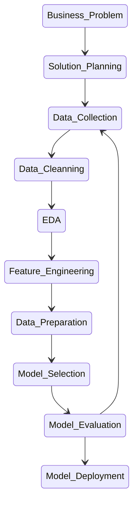

### Quickstart:
    cookiecutter https://github.com/nicolasCavalcante/cookiecutter-portifolio-ds.git
Or:

    python -m cookiecutter https://github.com/nicolasCavalcante/cookiecutter-portifolio-ds.git
Install and launch enviroment:

    pipenv install --dev
    pipenv shell
Run tests and formating, [Doit]:

    doit

    

------------
## Features

* [Pipenv] for managing packages and virtualenvs in a modern way.
* [MLFlow] for experiment tracking.
* Batteries included: [pandas], [plotly], and [scikit-learn] already installed.
* Code quality: [yapf], [isort], and [autoflake] already installed.
* [Pytest] for testing.
* [Doit] for automation.

## Data Science Process

### Business Problem
Description of the business problem to be solved using data science
### Solution Planning
What is the best aproach to solve this problem?
Which data can be helpfull?
How it is going to be solved?
### Data Collection
- Create the data collection pipeline
### EDA
Exploratory Data Analysis
- Get insight to business team
- Study data space and its impact on taget variables

### Data Preparation
Prepare data to be recieved by the machine learning algorithm
### Model Selection
Here, machine learning models are trained
### Model Evaluation
- Are the model metrics good enough?
- How does those metrics translate to business metrics?
- Is this project worth implementing?

#### References:
https://github.com/drivendata/cookiecutter-data-science
https://github.com/crmne/cookiecutter-modern-datascience
https://github.com/sourcery-ai/python-best-practices-cookiecutter
https://gist.github.com/bradtraversy/c70a93d6536ed63786c434707b898d55

[Cookiecutter]: https://github.com/audreyr/cookiecutter
[Pipenv]: https://pipenv.pypa.io/en/latest/
[plotly]: https://plotly.com/python/
[scikit-learn]: https://scikit-learn.org/stable/
[MLFlow]: https://mlflow.org/
[yapf]: https://github.com/google/yapf
[isort]: https://github.com/timothycrosley/isort
[autoflake]: https://github.com/myint/autoflake
[Pandas]: https://pandas.pydata.org/
[Pytest]: https://docs.pytest.org/en/latest/
[Git LFS]: https://git-lfs.github.com/
[Doit]: https://pydoit.org/