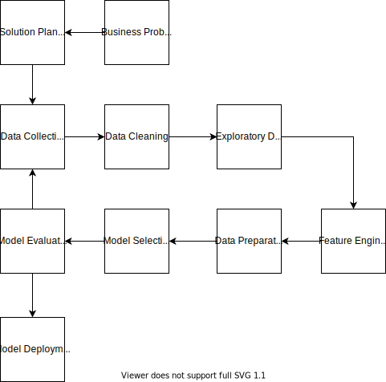

### Quickstart:
    cookiecutter https://github.com/nicolasCavalcante/cookiecutter-portifolio-ds.git
Or:

    python -m cookiecutter https://github.com/nicolasCavalcante/cookiecutter-portifolio-ds.git

#### If you said "No" to "setup_project":

Create Git repository:

    git init
    git add *
    git commit -m 'Inital commit'

Install and launch enviroment:

    pipenv install --dev
    pipenv shell

Run tests and formating, [Doit]:

    doit

    

------------
## Features

* [Pipenv] for managing packages and virtualenvs in a modern way.
* [MLFlow] for experiment tracking.
* Batteries included: [pandas], [plotly], and [scikit-learn] already installed.
* Code quality: [yapf], [isort], and [autoflake] already installed.
* [Pytest] for testing.
* [Doit] for automation.

## Directory structure

This is our your new project will look like:

    │   .gitignore                <- GitHub's excellent Python .gitignore customized for this project
    │   AUTHORS.md                <- Project Authors
    │   dodo.py                   <- doit dodo script for linting and tests
    │   LICENSE                   <- Your project's license.
    │   Pipfile                   <- The Pipfile for reproducing the analysis environment
    │   README.md                 <- The top-level README for developers using this project.
    │   setup.py                  <- makes project pip installable (pip install -e .) so src can be imported
    │
    ├── data
    │   ├── 0_raw                 <- The original, immutable data dump.
    │   ├── 0_external            <- Data from third party sources.
    │   ├── 1_interim             <- Intermediate data that has been transformed.
    │   └── 2_final               <- The final, canonical data sets for modeling.
    │
    ├── notebooks                 <- Jupyter notebooks. Naming convention is a number (for ordering),
    │                                the creator's initials, and a short `_` delimited description, e.g.
    │                                `01_cp_exploratory_data_analysis.ipynb`.
    │
    ├── output
    │   ├── features              <- Fitted and serialized features
    │   ├── models                <- Trained and serialized models, model predictions, or model summaries
    │   └── reports               <- Generated analyses as HTML, PDF, LaTeX, etc.
    │       └── figures           <- Generated graphics and figures to be used in reporting
    │
    ├───tests                     <- All project tests
    │
    └───<repo_name>
        │   build_features.py     <- turn raw data into features for modeling
        │   dag_executor.py       <- DAG pipeline tool for python
        │   make_dataset.py       <- download and generate data
        │   visualize.py          <- create exploratory and results oriented visualizations
        │
        └───models                <- Scripts to train models and then use trained models to make predictions
                predict.py
                train.py
## Data Science Process

### Business Problem
Description of the business problem to be solved using data science
### Solution Planning
What is the best aproach to solve this problem?
Which data can be helpfull?
How it is going to be solved?
### Data Collection
- Create the data collection pipeline
### Data Cleaning
- Remove unuseful columns and outliers
### EDA
Exploratory Data Analysis
- Get insight to business team
- Study data space and its impact on taget variables
### Feature Engineering
Create useful features from data to make model better to train
### Data Preparation
Prepare data to be recieved by the machine learning algorithm
### Model Selection
Here, machine learning models are trained
### Model Evaluation
- Are the model metrics good enough?
- How does those metrics translate to business metrics?
- Is this project worth implementing?
### Model Deployment
Turn the model acessible by others

#### References:
https://github.com/drivendata/cookiecutter-data-science
https://github.com/crmne/cookiecutter-modern-datascience
https://github.com/sourcery-ai/python-best-practices-cookiecutter
https://gist.github.com/bradtraversy/c70a93d6536ed63786c434707b898d55

[Cookiecutter]: https://github.com/audreyr/cookiecutter
[Pipenv]: https://pipenv.pypa.io/en/latest/
[plotly]: https://plotly.com/python/
[scikit-learn]: https://scikit-learn.org/stable/
[MLFlow]: https://mlflow.org/
[yapf]: https://github.com/google/yapf
[isort]: https://github.com/timothycrosley/isort
[autoflake]: https://github.com/myint/autoflake
[Pandas]: https://pandas.pydata.org/
[Pytest]: https://docs.pytest.org/en/latest/
[Git LFS]: https://git-lfs.github.com/
[Doit]: https://pydoit.org/